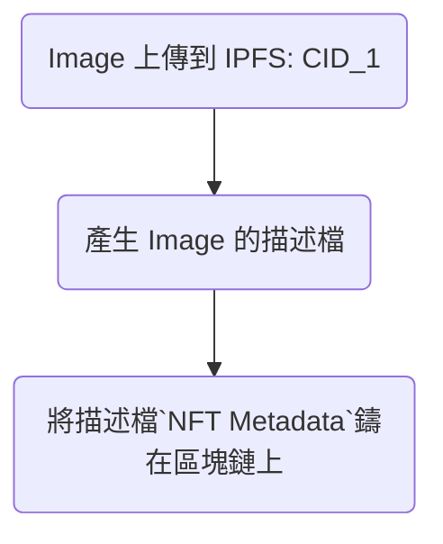
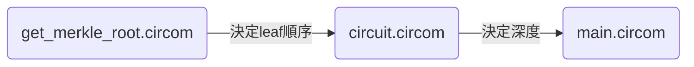
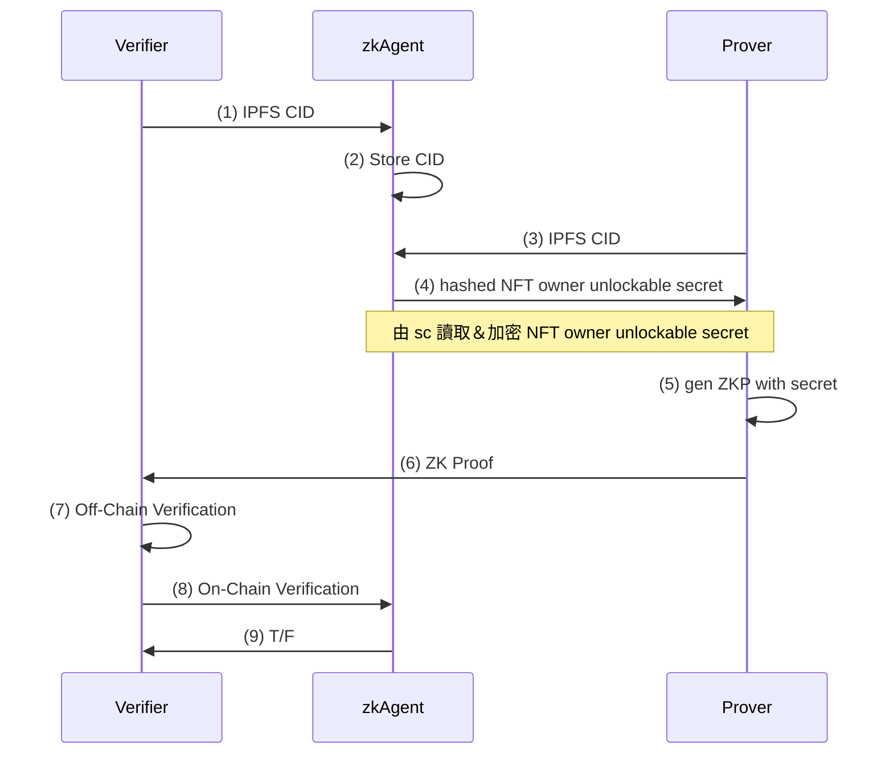
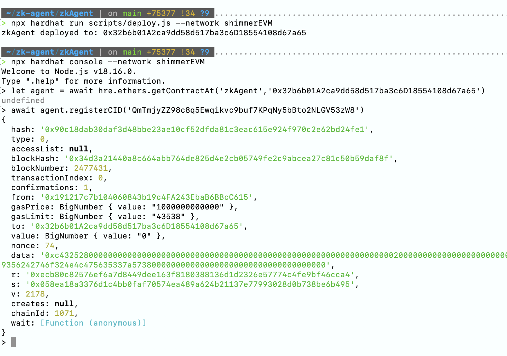
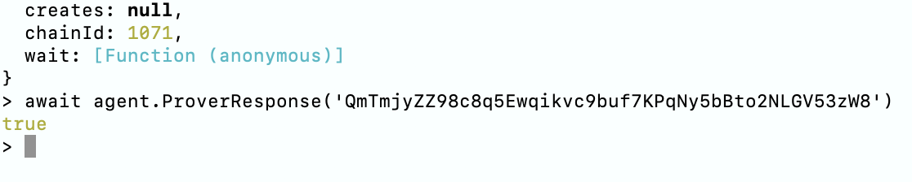
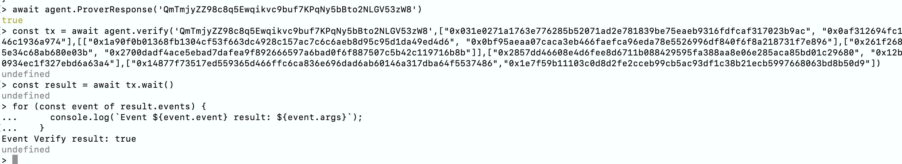
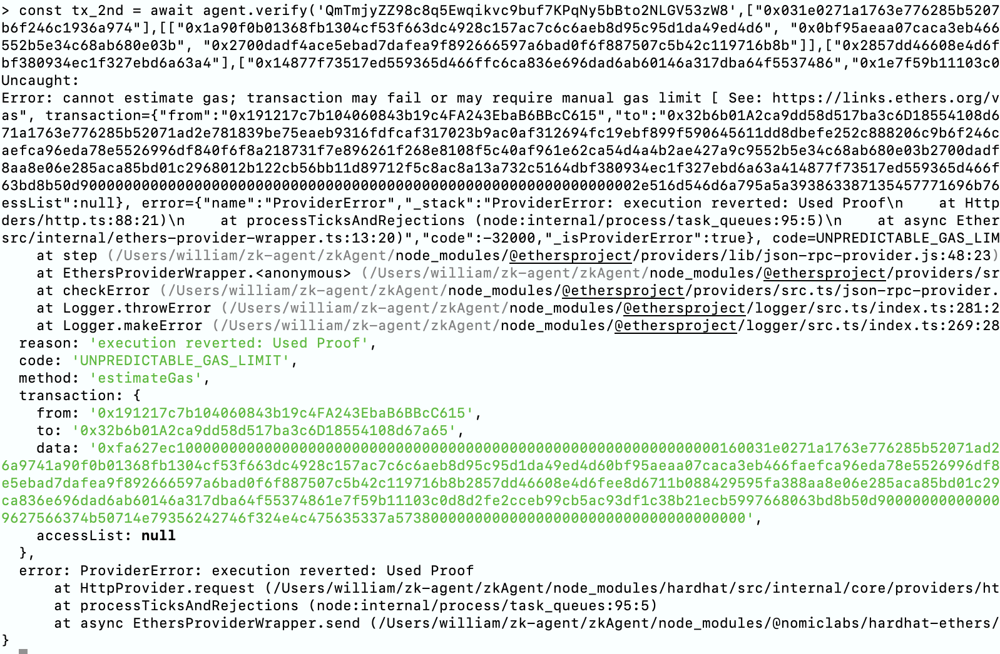

---
# try also 'default' to start simple
theme: seriph
# random image from a curated Unsplash collection by Anthony
# like them? see https://unsplash.com/collections/94734566/slidev
background: https://source.unsplash.com/collection/94734566/1920x1080
# apply any windi css classes to the current slide
class: 'text-center'
# https://sli.dev/custom/highlighters.html
highlighter: shiki
# show line numbers in code blocks
lineNumbers: false
# some information about the slides, markdown enabled
info: |
  ## Slidev Starter Template
  Presentation slides for developers.

  Learn more at [Sli.dev](https://sli.dev)
# persist drawings in exports and build
drawings:
  persist: false
# page transition
transition: slide-left
# use UnoCSS
css: unocss
---

# Cryptography Term Project - Decentralized Storage with Zero Knowledge Proof of Ownership

密碼學期末 - 去中心化儲存中的所有權零知識證明 <br>
組員 - 陳學義、邱浩宸

<div class="pt-12">
  <span @click="$slidev.nav.next" class="px-2 py-1 rounded cursor-pointer" hover="bg-white bg-opacity-10">
    Press Space for next page <carbon:arrow-right class="inline"/>
  </span>
</div>

<!--
<div class="abs-br m-6 flex gap-2">
  <button @click="$slidev.nav.openInEditor()" title="Open in Editor" class="text-xl slidev-icon-btn opacity-50 !border-none !hover:text-white">
    <carbon:edit />
  </button>
  <a href="https://github.com/slidevjs/slidev" target="_blank" alt="GitHub"
    class="text-xl slidev-icon-btn opacity-50 !border-none !hover:text-white">
    <carbon-logo-github />
  </a>
</div>
-->
<!--
The last comment block of each slide will be treated as slide notes. It will be visible and editable in Presenter Mode along with the slide. [Read more in the docs](https://sli.dev/guide/syntax.html#notes)
-->

---
transition: fade-out
---

# 大綱


- 📝 **Building Blocks** - 定義問題、Overview
- 🧑‍💻 **去中心化儲存** - IPFS、NFT
- 🤹 **零知識證明** - 套件使用、簡介 Merkle Tree、迴路設計、智能合約設計
- 🎨 **驗證流程** 
- 🎥 **Demo** - 鏈上驗證，鏈下驗證
- 🎥 **Future Work** - 去中心化儲存 + ZKP + DID Document，實作 Owner unlockable NFT

<br>
<br>


<!--
You can have `style` tag in markdown to override the style for the current page.
Learn more: https://sli.dev/guide/syntax#embedded-styles
-->

<style>
h1 {
  background-color: #2B90B6;
  background-image: linear-gradient(45deg, #4EC5D4 10%, #146b8c 20%);
  background-size: 100%;
  -webkit-background-clip: text;
  -moz-background-clip: text;
  -webkit-text-fill-color: transparent;
  -moz-text-fill-color: transparent;
}
</style>

<!--
Here is another comment.
-->
---
transition: fade-out
---
# 定義問題

#### Status Quo:
 1. 大多數 Public Permissionless 的區塊鏈應用現階段所遇到的主要問題為 (a).吞吐量 (b).隱私問題
 2. 以太坊生態系(web3生態系)的 Layer2 有許多處理以上兩個問題的協定/專案 e.g. Uniswap for (a), Polygon zkEVM for (b)
#### Problem Formulation:
 1. 大多數區塊鏈應用都是基於地址或公鑰，由於區塊鏈的可追朔性，知道公鑰等價於知道某個人過去所有交易
 2. 只要有方法把公鑰跟所有者關聯就會洩漏所有者大量隱私 
 3. 若要保持去信任化，又不透露公鑰，可以有什麼做法？
#### Actions:
 1. 透過零知識證明與智能合約來同時繞過公鑰且保持去信任化
 2. 考慮一個在不透露公鑰的前提下證明自己擁有一個 NFT (或鏈上資產)
#### Demo:
 1. 設計一個驗證流程
 2. 利用circom ,zkSnark 及 solidity 完成驗證流程 

---
transition: fade-out
---
# 去中心化儲存：IPFS, NFT

<div grid="~ cols-2 gap-4">
<div>
透過 infura ipfs gateway 把檔案pin住 <br>
```text
link:
https://wdnmd-nft.infura-ipfs.io/ipfs/QmTmjyZZ98c8q5Ewqikvc9buf7KPqNy5bBto2NLGV53zW8
```
圖檔：

</div>
<div>

</div>
</div>
---
transition: fade-out
---

# ZKP - 套件使用 & 操作

1. **circom** - 迴路設計, 使用 ZKP friendly hash: Poseidon


2. **snarkJS**(zkSnark) - Groth16 preset: (*Phase1*). Generate witness, (*Phase2*). Groth16 setup circuit by R1CS 
    * (1) Export VerificationKey
    * (2) Create proof (gen. proof.json & public.json)
    * (3) Off-chain verify proof.json & public.json with verification_key.json
    * (4) Export sc callables
    * (5) Turn verifier into smart contract
```bash {all|1|2|3|4|5|all}
1) $snarkjs zkey export verificationkey ${CUR_DIR}/circuit_final.zkey verification_key.json
2) $snarkjs groth16 prove ${CUR_DIR}/circuit_final.zkey witness.wtns proof.json public.json
3) $snarkjs groth16 verify verification_key.json public.json proof.json
4) $snarkjs zkey export soliditycalldata public.json proof.json
5) $snarkjs zkey export solidityverifier ${CUR_DIR}/circuit_final.zkey ../contracts/verifier.sol
```
<!--
<arrow v-click="3" x1="800" y1="500" x2="700" y2="400" color="#564" width="3" arrowSize="1"/>

<style>
.footnotes-sep {
  @apply mt-20 opacity-10;
}
.footnotes {
  @apply text-sm opacity-75;
}
.footnote-backref {
  display: none;
}
</style>
-->
---
transition: fade-out
---
# ZKP - Merkle Tree 簡介
<div grid="~ cols-2 gap-4">
<div>
1. Preimage: L1 ~ L4 <br>
2. Leaf: hash(Preimage) <br>
3. 第二次hash 是先將兩個Leaf hash concat起來再hash -> 講究左右順序 <br>
4. 只要有任何一片 leaf 改變或其左右順序改變，root也會改變<br>
5. Merkle tree 證明邏輯 <br>
&nbsp 公開資訊：(1). Root  <br>
&nbsp 隱私資訊：(1). Merkle Path, (2). Merkle Path Position <br>
Verifier在公開場域得到root1, Prover在非公開場域透過隱私資訊計算出root2; root1, root2相等為得證
</div>

<!--
-->

</div>


---
transition: fade-out
---
# ZKP - 迴路設計 (circom)
1. get_merkle_root: (1). Input/Output, (2).決定順序(pos=0 or 1)
```verilog {all|1-4|6-7}
  signal input leaf;
  signal input paths2_root[k];
  signal input paths2_root_pos[k];
  signal output out;
  ...
  merkle_root[0].inputs[0] <== paths2_root[0] - paths2_root_pos[0] * (paths2_root[0] - leaf);
  merkle_root[0].inputs[1] <== leaf - paths2_root_pos[0] * (leaf - paths2_root[0]);
```
---
transition: fade-out
---
# ZKP - 迴路設計 (circom) cont.
2. circuit: 
* (1) 沿用get_merkle_tree.circom 
* (2-6) 本地計算merkle root 
* (7) 比較輸入root與本地計算root, 需相等
* (9-12) 一樣邏輯比較輸入與本地nullifier
```verilog {all|1|2-6|7|9-12|all}
  1) component computed_root = GetMerkleRoot(k);
  2) computed_root.leaf <== leaf.out;
     for (var w = 0; w < k; w++){
         computed_root.paths2_root[w] <== paths2_root[w];
         computed_root.paths2_root_pos[w] <== paths2_root_pos[w];
     }
  7) root === computed_root.out;
  ...
  9) component nullifier = Poseidon(2);
     nullifier.inputs[0] <== cmt_index.out;
     nullifier.inputs[1] <== secret;
 12) nullifierHash === nullifier.out;
```
---
transition: fade-out
---
# ZKP - 智能合約設計
<div grid="~ cols-2 gap-4">
<div>
<b>CID 註冊</b>, Verifier向zkAgent註冊CID <br>
(6). zkAgent 紀錄 Ｖerifier 提交的 CID <br>
```solidity{all|6|all}
1)   mapping(string => bool) public CheckCID;
2)   ...
3)   function registerCID(
4)       string calldata _cid
5)   )public{
6)       CheckCID[_cid] = true;
7)   }
```
<b> CID 檢驗</b> , Prover 向 zkAgent 回應 CID <br>
(3). 只回送CID已記錄與否 <br>
(4). 必須要有紀錄，否則Prover無需進行證明 <br>
```solidity{all|3|4|all}
1) function ProverResponse(
2)         string calldata _cid
3)     )public view returns (bool r){
4)         require(CheckCID[_cid], "Unrecognized CID");
5)         return true;
6)     }
```
</div>
<div>
<b> 主合約 </b><br>
(1). 引用 snarkJS 產生的 verifier.sol <br>
(2-4). 透過 mapping 鏈上紀錄用過的root 及 nullifier <br>
(5,14). 將event emit給後台 <br>
(8-10). 檢查輸入的 root, CID 及 nullifier <br>
(11-12). 檢查通過則紀錄輸入的 root 及 nullifier <br>
```solidity{all|1|2-4|5,14|8-10|11-12|all}
 1) contract zkAgent is Verifier{
 2)     mapping(uint256 => bool) public CheckNullifier;
 3)     mapping(uint256 => bool) public CheckRoot;
 4)     mapping(string => bool) public CheckCID;
 5)     event Verify(bool r);
 6)  ...
 7) function verify(
 8)     require(!CheckNullifier[_nullifierHash], "Used Proof");
 9)     require(!CheckRoot[_root], "Used Root");
10)     require(CheckCID[_cid], "CID not registered");
11)     CheckNullifier[_nullifierHash] = true;
12)     CheckRoot[_root] = true;
13) 
14)     emit Verify(this.verifyProof(a, b, c, input));
```
</div>
</div>
---
transition: fade-out
---
# 驗證流程
<!--request NFT owner unlockable secret by sc and return hashed secret-->
<div class="grid grid-cols-2 pt-2 ">
<div>
(1). Verifier 傳送欲驗證的 Content ID 給 zkAgent <br>
(2). zkAgent 在鏈上儲存 CID <br>
(3-1). Prover 傳送欲證明的 CID 給 zkAgent <br>
(3-2). zkAgent 檢查 Prover 傳送 CID 已存在與否 <br>
(4-1). (開發中) zkAgent 鏈上檢查 CID, NFT metadata 的所有權屬於 Prover <br>
(4-2). (開發中) zkAgent 鏈上讀取 NFT owner unlockable secret (或其他Access Control方法) 並加密回傳 <br>
(5). Prover 將加密 secret 餵進本地迴路生成 ZK Proof <br>
(6). Prover 將 Proof 傳給 Verifier <br>
(7). Verifier 透過 Groth16 進行鏈下驗證 <br>
(8). Verifier 將 Proof 傳給 zkAgent 進行鏈上 one-time 驗證 <br>
(9). zkAgent 回傳驗證結果 True False
</div>
<div>

</div>
</div>
---
transition: fade-out
---

# Demo - 鏈上驗證: 使用套件 ＆ 部署環境：

1. 部署套件：hardhat
2. 測試套件：hardhat console
3. 部署網路：IOTA shimmer EVM

套件使用指令
```bash
npx hardhat run scripts/deploy.js --network shimmerEVM
npx hardhat console --network shimmerEVM
```

區塊鏈網路設定 (hardhat.config.ts)
```typescript
module.exports = {
  solidity: '0.8.3',
  networks:{
    'shimmerEVM':{
      url:'https://json-rpc.evm.testnet.shimmer.network',
      chainId: 1071,
      accounts: ["<PRIVATE_KEY>"],
    },
```

---
transition: fade-out
---

# Demo - 鏈上驗證

##### 合約部署 (deploy.js)
* (1). 引用 hardhat 套件
* (6). 將合約擁有者 address 餵給constructor
* (8). 合約部署在擁有者名下
```javascript{all|1|6|8|all}
1. const hre = require("hardhat");
2. async function main() {
3.   const signers = await hre.ethers.getSigners();
4.   const zkAgent = await hre.ethers.getContractFactory("zkAgent");
5. 
6.   const zkAgentOwner = await zkAgent.deploy(signers[0].address);
7.   
8.   await zkAgentOwner.deployed();
9.   console.log('zkAgent deployed to:', zkAgentOwner.address);
10. }
```
---
transition: fade-out
---

# Demo - 鏈上驗證: 合約測試

#### Verifier 註冊 CID (有transaction)
```javascript
let agent = await hre.ethers.getContractAt('zkAgent',<ContractAddress>)
await agent.registerCID(<CID>)
```
<br>

---
transition: fade-out
---

# Demo - 鏈上驗證: 合約測試

#### Prover 回應 CID Challenge, 檢查 CID 是否已註冊 (無transaction)

```javascript
//return T/F
await agent.ProverResponse(<CID>) 
```
<br>

---
transition: fade-out
---

# Demo - 鏈上驗證: 合約測試

#### Verifier 收到 Proof 後鏈上驗證 (有transaction)

```javascript{all|1|4-6|all}
1. const tx = await agent.verify(<CID>,<proof>)
2. const result = await tx.wait()
3. 
4. for (const event of result.events) {
5.     console.log(`Event ${event.event} result: ${event.args}`);
6.   }
```
<br>


---
transition: fade-out
---

# Demo - 鏈上驗證: 二次驗證
<div grid="~ cols-2 gap-4">

<arrow x1="350" y1="445" x2="250" y2="345" color="#564" width="3" arrowSize="1"/>

<style>
.footnotes-sep {
  @apply mt-20 opacity-10;
}
.footnotes {
  @apply text-sm opacity-75;
}
.footnote-backref {
  display: none;
}
</style>
<div>
1. 用過的Proof會被合約檢查出來 <br>
2. 並且報錯列在 terminal <br>
3. CID 也同理 <br>
```solidity
require(!CheckNullifier[_nullifierHash], "Used Proof");
require(!CheckRoot[_root], "Used Root");
require(CheckCID[_cid], "CID not registered");
```
</div>
</div>
